# HexShare Architecture

---

## Table of Contents

1. [Product Overview](#1-product-overview)
2. [C4 System Context](#2-c4-system-context)
3. [C4 Container Diagram](#3-c4-container-diagram)
4. [C4 Component Diagram — HexShare API](#4-c4-component-diagram--hexshare-api)
5. [User Flows](#5-user-flows)
6. [Sequence Diagrams](#6-sequence-diagrams)
   - [OIDC Login Flow](#oidc-login-flow)
   - [Token Refresh Flow](#token-refresh-flow)
   - [Document Upload Flow](#document-upload-flow)
   - [Share Link Creation & Visitor View](#share-link-creation--visitor-view)
   - [PDF Page Streaming](#pdf-page-streaming)
   - [Background Pre-render Flow](#background-pre-render-flow)
7. [Authorization Flow](#7-authorization-flow)
8. [Adapter Selection at Startup](#8-adapter-selection-at-startup)
9. [Data Flow Diagrams](#9-data-flow-diagrams)
10. [Document Processing Pipeline](#10-document-processing-pipeline)
11. [Domain Model (ERD)](#11-domain-model-erd)
12. [State Diagrams](#12-state-diagrams)
13. [Repository Architecture](#13-repository-architecture)
14. [Hexagonal Architecture Explained](#14-hexagonal-architecture-explained)
15. [Runtime & Infrastructure](#15-runtime--infrastructure)

---

## 1. Product Overview

HexShare is a self-hostable secure document sharing platform that sits between lightweight link sharing and a full virtual data room. It is API-first, built on FastAPI and React, uses S3-compatible object storage for document bytes, and can run either against HexIAM-issued tokens or locally-issued HexShare session tokens derived from upstream OIDC login.

The current implementation supports the core secure-delivery loop end to end: OIDC login, local session minting, presigned uploads, share-link issuance, server-mediated viewing, page-level PDF rendering with watermarking, event logging, background prerendering, and a compose-driven self-hosting path that can bundle HexIAM alongside the app.

| Capability | Status | Notes |
|---|---|---|
| OIDC authentication | ✅ | PKCE flow with signed temporary state cookie |
| Presigned upload to object storage | ✅ | Browser uploads directly to object storage; backend finalizes metadata |
| Share links with per-link permissions | ✅ | Download, print, expiry, email gating |
| Secure viewer sessions | ✅ | Session creation, close events, SSE keepalive |
| PDF page rendering + watermarking | ✅ | `pdf_oxide` + Pillow, pixel-baked into each page image |
| Background prerender worker | ✅ | Queue worker warms rendered page cache ahead of scroll |
| Document groups backed by IAM policy | ✅ | Group access modeled as dynamic IAM resources |
| Local session mode | ✅ | Upstream OIDC login can terminate into local HexShare access + refresh cookies |
| Multiple OIDC client adapters | ✅ | HexIAM and Google clients are wired into startup selection |
| Share-token JTI revocation store | ✅ | In-memory by default; Redis-backed adapter available for multi-instance deployments |
| Bundled HexIAM self-host overlay | ✅ | `docker-compose.with-hexiam.yaml` + bootstrap script prepare a combined stack |
| Upload metadata columns | ✅ | `upload_status`, `object_etag`, `checksum_sha256`, `uploaded_at` |
| DOCX inline viewing | 🔜 | Currently download-only |
| External-party identity model | 🔜 | Email capture exists; richer external identity workflows are still open |
| AI Q&A per document corpus | 🔜 | |
| Redlines / tracked changes | 🔜 | |

> All diagrams below use render-safe Mermaid primitives rather than the C4 extension syntax so they display reliably across common Markdown renderers.

---

## 2. C4 System Context

HexShare connects document owners to external viewers. It is an infrastructure-level service: B2B teams, solo operators, and B2C platforms all deploy it against their own identity provider and object storage — the system context is identical regardless of deployment scale.

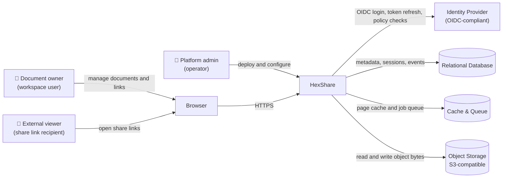
```mermaid
flowchart LR
    owner["👤 Document owner\n(workspace user)"]
    viewer["👥 External viewer\n(share link recipient)"]
    admin["🔧 Platform admin\n(operator)"]
    browser["Browser"]
    hexshare["HexShare"]
    idp["Identity Provider\n(OIDC-compliant)"]
    postgres[("Relational Database")]
    redis[("Cache & Queue")]
    store[("Object Storage\nS3-compatible")]

    owner -->|"manage documents and links"| browser
    viewer -->|"open share links"| browser
    admin -->|"deploy and configure"| hexshare
    browser -->|"HTTPS"| hexshare
    hexshare -->|"OIDC login, token refresh, policy checks"| idp
    hexshare -->|"metadata, sessions, events"| postgres
    hexshare -->|"page cache and job queue"| redis
    hexshare -->|"read and write object bytes"| store
```

> **Deployment flexibility:** The "document owner" can be a single individual or (Founder) building on HexShare, a team member at a B2B SaaS company, or an organisation with hundreds of users. HexShare is not scoped to internal teams — it is a general-purpose secure sharing layer.

---

## 3. C4 Container Diagram

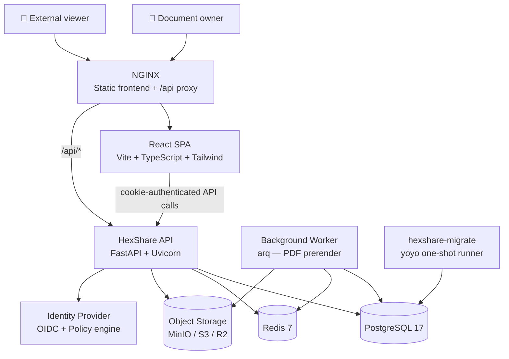
```mermaid
flowchart TB
    owner["👤 Document owner"]
    viewer["👥 External viewer"]

    nginx["NGINX\nStatic frontend + /api proxy"]
    spa["React SPA\nVite + TypeScript + Tailwind"]
    api["HexShare API\nFastAPI + Uvicorn"]
    worker["Background Worker\narq — PDF prerender"]
    migrate["hexshare-migrate\nyoyo one-shot runner"]

    idp["Identity Provider\nOIDC + Policy engine"]
    postgres[("PostgreSQL 17")]
    redis[("Redis 7")]
    store[("Object Storage\nMinIO / S3 / R2")]

    owner --> nginx
    viewer --> nginx
    nginx --> spa
    nginx -->|"/api/*"| api
    spa -->|"cookie-authenticated API calls"| api

    api --> postgres
    api --> redis
    api --> store
    api --> idp

    worker --> postgres
    worker --> redis
    worker --> store

    migrate --> postgres
```

---

## 4. C4 Component Diagram — HexShare API

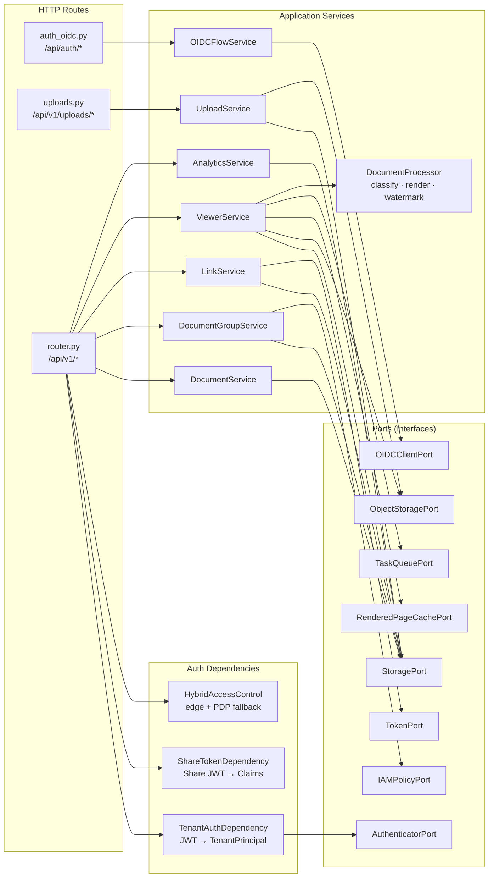
```mermaid
flowchart LR
    subgraph Routes["HTTP Routes"]
        oidc_api["auth_oidc.py\n/api/auth/*"]
        upload_api["uploads.py\n/api/v1/uploads/*"]
        main_api["router.py\n/api/v1/*"]
    end

    subgraph Dependencies["Auth Dependencies"]
        tenant_auth["TenantAuthDependency\nJWT → TenantPrincipal"]
        share_auth["ShareTokenDependency\nShare JWT → Claims"]
        access_control["HybridAccessControl\nedge + PDP fallback"]
    end

    subgraph Services["Application Services"]
        doc_svc["DocumentService"]
        group_svc["DocumentGroupService"]
        link_svc["LinkService"]
        viewer_svc["ViewerService"]
        upload_svc["UploadService"]
        analytics_svc["AnalyticsService"]
        oidc_svc["OIDCFlowService"]
        processor["DocumentProcessor\nclassify · render · watermark"]
    end

    subgraph Ports["Ports (Interfaces)"]
        storage_port["StoragePort"]
        object_port["ObjectStoragePort"]
        token_port["TokenPort"]
        iam_port["IAMPolicyPort"]
        cache_port["RenderedPageCachePort"]
        queue_port["TaskQueuePort"]
        oidc_port["OIDCClientPort"]
        authn_port["AuthenticatorPort"]
    end

    oidc_api --> oidc_svc
    oidc_svc --> oidc_port

    upload_api --> upload_svc
    upload_svc --> storage_port
    upload_svc --> object_port

    main_api --> tenant_auth & share_auth & access_control
    main_api --> doc_svc & group_svc & link_svc & viewer_svc & analytics_svc

    doc_svc --> storage_port
    group_svc --> storage_port & iam_port
    link_svc --> storage_port & token_port
    analytics_svc --> storage_port
    viewer_svc --> storage_port & object_port & cache_port & queue_port & processor

    tenant_auth --> authn_port
```

---

## 5. User Flows

### Document Owner Journey

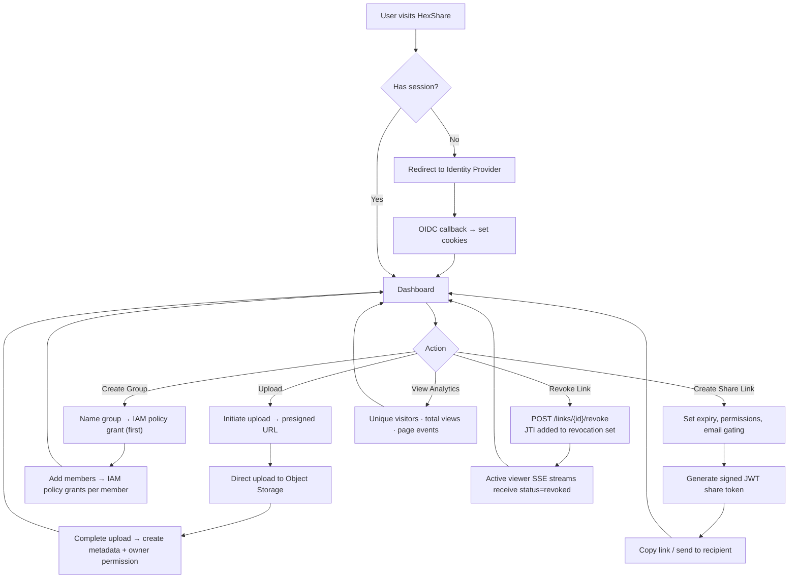
```mermaid
flowchart TD
    A["User visits HexShare"] --> B{"Has session?"}
    B -->|No| C["Redirect to Identity Provider"]
    C --> D["OIDC callback → set cookies"]
    D --> E["Dashboard"]
    B -->|Yes| E

    E --> F{"Action"}

    F -->|Upload| G["Initiate upload → presigned URL"]
    G --> H["Direct upload to Object Storage"]
    H --> I["Complete upload → create metadata + owner permission"]
    I --> E

    F -->|Create Group| J["Name group → IAM policy grant (first)"]
    J --> K["Add members → IAM policy grants per member"]
    K --> E

    F -->|Create Share Link| L["Set expiry, permissions, email gating"]
    L --> M["Generate signed JWT share token"]
    M --> N["Copy link / send to recipient"]
    N --> E

    F -->|Revoke Link| O["POST /links/{id}/revoke\nJTI added to revocation set"]
    O --> P["Active viewer SSE streams receive status=revoked"]
    P --> E

    F -->|View Analytics| Q["Unique visitors · total views · page events"]
    Q --> E
```

### External Viewer Journey

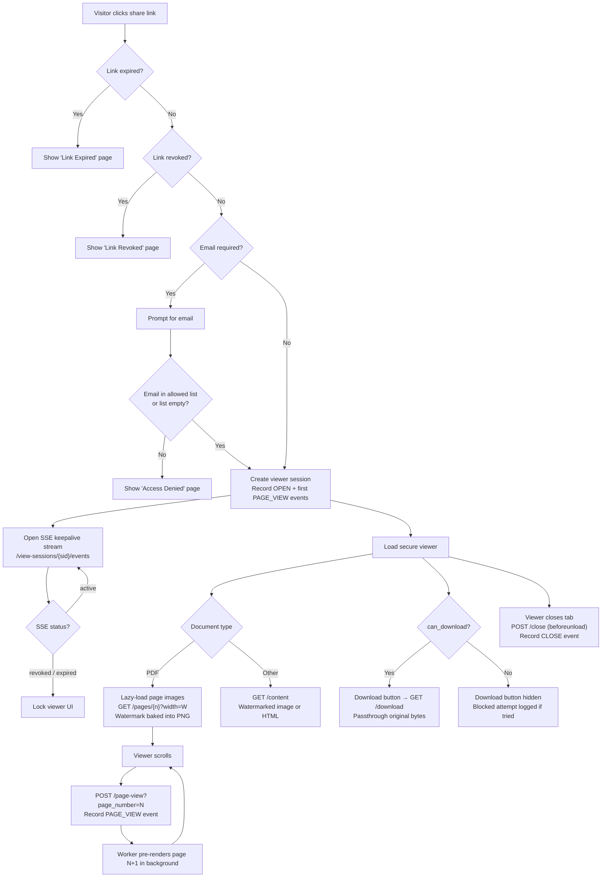
```mermaid
flowchart TD
    A["Visitor clicks share link"] --> B{"Link expired?"}
    B -->|Yes| C["Show 'Link Expired' page"]
    B -->|No| D{"Link revoked?"}
    D -->|Yes| E["Show 'Link Revoked' page"]
    D -->|No| F{"Email required?"}

    F -->|Yes| G["Prompt for email"]
    G --> H{"Email in allowed list\nor list empty?"}
    H -->|No| I["Show 'Access Denied' page"]
    H -->|Yes| J
    F -->|No| J

    J["Create viewer session\nRecord OPEN + first PAGE_VIEW events"]
    J --> K["Open SSE keepalive stream\n/view-sessions/{sid}/events"]
    J --> L["Load secure viewer"]

    L --> M{"Document type"}
    M -->|PDF| N["Lazy-load page images\nGET /pages/{n}?width=W\nWatermark baked into PNG"]
    M -->|Other| O["GET /content\nWatermarked image or HTML"]

    N --> P["Viewer scrolls"]
    P --> Q["POST /page-view?page_number=N\nRecord PAGE_VIEW event"]
    Q --> R["Worker pre-renders page N+1 in background"]
    R --> P

    L --> S{"can_download?"}
    S -->|Yes| T["Download button → GET /download\nPassthrough original bytes"]
    S -->|No| U["Download button hidden\nBlocked attempt logged if tried"]

    K --> V{"SSE status?"}
    V -->|"revoked / expired"| W["Lock viewer UI"]
    V -->|active| K

    L --> X["Viewer closes tab\nPOST /close (beforeunload)\nRecord CLOSE event"]
```

---

## 6. Sequence Diagrams

### OIDC Login Flow

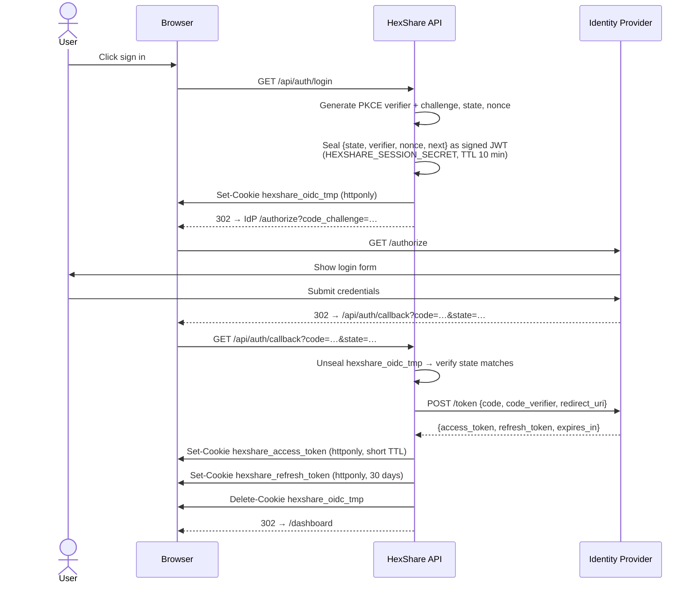
```mermaid
sequenceDiagram
    actor User
    participant Browser
    participant API as HexShare API
    participant IdP as Identity Provider

    User->>Browser: Click sign in
    Browser->>API: GET /api/auth/login
    API->>API: Generate PKCE verifier + challenge, state, nonce
    API->>API: Seal {state, verifier, nonce, next} as signed JWT<br/>(HEXSHARE_SESSION_SECRET, TTL 10 min)
    API->>Browser: Set-Cookie hexshare_oidc_tmp (httponly)
    API-->>Browser: 302 → IdP /authorize?code_challenge=…

    Browser->>IdP: GET /authorize
    IdP->>User: Show login form
    User->>IdP: Submit credentials
    IdP-->>Browser: 302 → /api/auth/callback?code=…&state=…

    Browser->>API: GET /api/auth/callback?code=…&state=…
    API->>API: Unseal hexshare_oidc_tmp → verify state matches
    API->>IdP: POST /token {code, code_verifier, redirect_uri}
    IdP-->>API: {access_token, refresh_token, expires_in}

    API->>Browser: Set-Cookie hexshare_access_token (httponly, short TTL)
    API->>Browser: Set-Cookie hexshare_refresh_token (httponly, 30 days)
    API->>Browser: Delete-Cookie hexshare_oidc_tmp
    API-->>Browser: 302 → /dashboard
```

---

### Token Refresh Flow

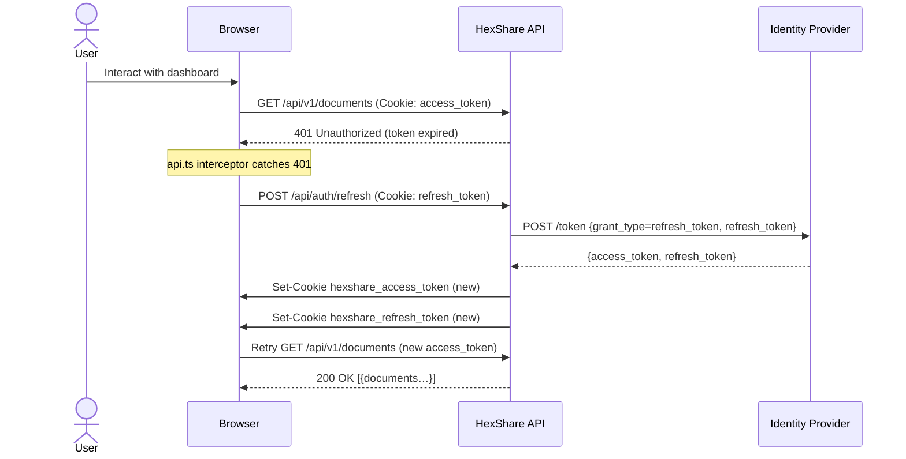
```mermaid
sequenceDiagram
    actor User
    participant Browser
    participant API as HexShare API
    participant IdP as Identity Provider

    User->>Browser: Interact with dashboard
    Browser->>API: GET /api/v1/documents (Cookie: access_token)
    API-->>Browser: 401 Unauthorized (token expired)

    Note over Browser: api.ts interceptor catches 401
    Browser->>API: POST /api/auth/refresh (Cookie: refresh_token)
    API->>IdP: POST /token {grant_type=refresh_token, refresh_token}
    IdP-->>API: {access_token, refresh_token}

    API->>Browser: Set-Cookie hexshare_access_token (new)
    API->>Browser: Set-Cookie hexshare_refresh_token (new)

    Browser->>API: Retry GET /api/v1/documents (new access_token)
    API-->>Browser: 200 OK [{documents…}]
```

---

### Document Upload Flow

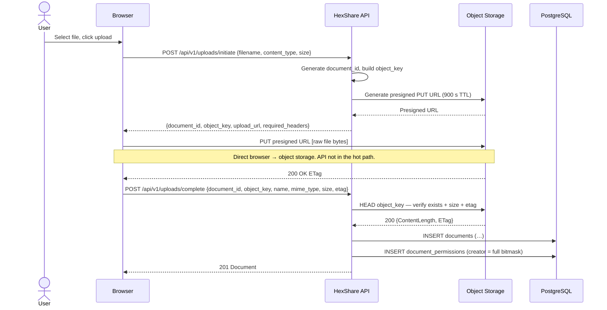
```mermaid
sequenceDiagram
    actor User
    participant Browser
    participant API as HexShare API
    participant Store as Object Storage
    participant PG as PostgreSQL

    User->>Browser: Select file, click upload
    Browser->>API: POST /api/v1/uploads/initiate {filename, content_type, size}
    API->>API: Generate document_id, build object_key
    API->>Store: Generate presigned PUT URL (900 s TTL)
    Store-->>API: Presigned URL
    API-->>Browser: {document_id, object_key, upload_url, required_headers}

    Browser->>Store: PUT presigned URL [raw file bytes]
    Note over Browser,Store: Direct browser → object storage. API not in the hot path.
    Store-->>Browser: 200 OK ETag

    Browser->>API: POST /api/v1/uploads/complete {document_id, object_key, name, mime_type, size, etag}
    API->>Store: HEAD object_key — verify exists + size + etag
    Store-->>API: 200 {ContentLength, ETag}
    API->>PG: INSERT documents (…)
    API->>PG: INSERT document_permissions (creator = full bitmask)
    API-->>Browser: 201 Document
```

---

### Share Link Creation & Visitor View

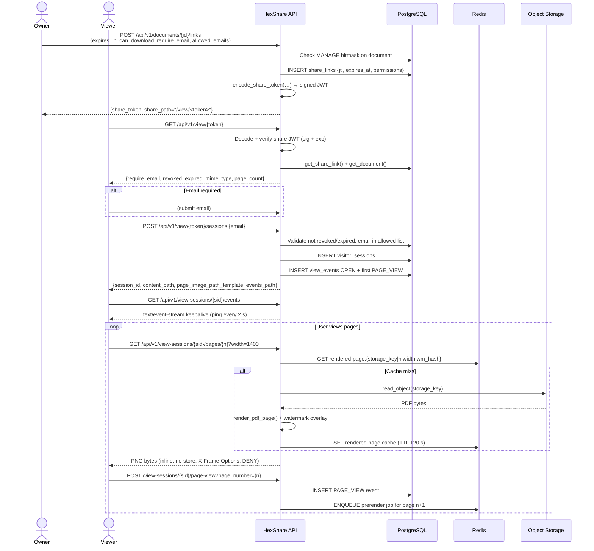
```mermaid
sequenceDiagram
    actor Owner
    actor Viewer
    participant API as HexShare API
    participant PG as PostgreSQL
    participant Redis
    participant Store as Object Storage

    Owner->>API: POST /api/v1/documents/{id}/links<br/>{expires_in, can_download, require_email, allowed_emails}
    API->>PG: Check MANAGE bitmask on document
    API->>PG: INSERT share_links {jti, expires_at, permissions}
    API->>API: encode_share_token(…) → signed JWT
    API-->>Owner: {share_token, share_path="/view/<token>"}

    Viewer->>API: GET /api/v1/view/{token}
    API->>API: Decode + verify share JWT (sig + exp)
    API->>PG: get_share_link() + get_document()
    API-->>Viewer: {require_email, revoked, expired, mime_type, page_count}

    alt Email required
        Viewer->>API: (submit email)
    end

    Viewer->>API: POST /api/v1/view/{token}/sessions {email}
    API->>PG: Validate not revoked/expired, email in allowed list
    API->>PG: INSERT visitor_sessions
    API->>PG: INSERT view_events OPEN + first PAGE_VIEW
    API-->>Viewer: {session_id, content_path, page_image_path_template, events_path}

    Viewer->>API: GET /api/v1/view-sessions/{sid}/events
    API-->>Viewer: text/event-stream keepalive (ping every 2 s)

    loop User views pages
        Viewer->>API: GET /api/v1/view-sessions/{sid}/pages/{n}?width=1400
        API->>Redis: GET rendered-page:{storage_key|n|width|wm_hash}
        alt Cache miss
            API->>Store: read_object(storage_key)
            Store-->>API: PDF bytes
            API->>API: render_pdf_page() + watermark overlay
            API->>Redis: SET rendered-page cache (TTL 120 s)
        end
        API-->>Viewer: PNG bytes (inline, no-store, X-Frame-Options: DENY)
        Viewer->>API: POST /view-sessions/{sid}/page-view?page_number={n}
        API->>PG: INSERT PAGE_VIEW event
        API->>Redis: ENQUEUE prerender job for page n+1
    end
```

---

### PDF Page Streaming

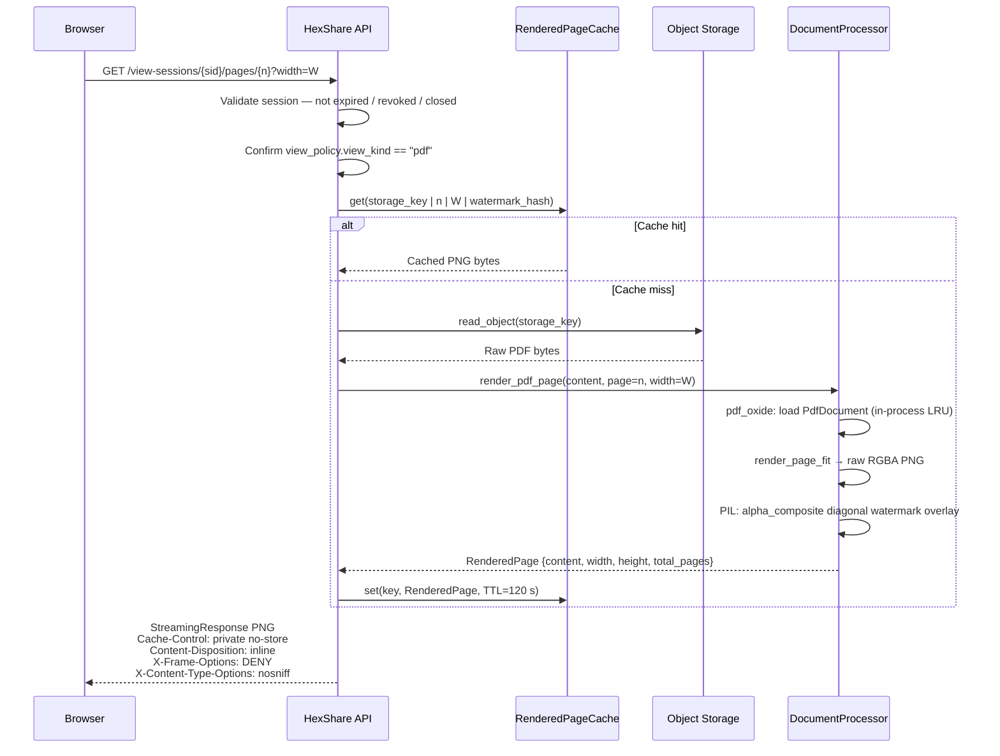
```mermaid
sequenceDiagram
    participant Browser
    participant API as HexShare API
    participant Cache as RenderedPageCache
    participant Store as Object Storage
    participant Proc as DocumentProcessor

    Browser->>API: GET /view-sessions/{sid}/pages/{n}?width=W
    API->>API: Validate session — not expired / revoked / closed
    API->>API: Confirm view_policy.view_kind == "pdf"
    API->>Cache: get(storage_key | n | W | watermark_hash)

    alt Cache hit
        Cache-->>API: Cached PNG bytes
    else Cache miss
        API->>Store: read_object(storage_key)
        Store-->>API: Raw PDF bytes
        API->>Proc: render_pdf_page(content, page=n, width=W)
        Proc->>Proc: pdf_oxide: load PdfDocument (in-process LRU)
        Proc->>Proc: render_page_fit → raw RGBA PNG
        Proc->>Proc: PIL: alpha_composite diagonal watermark overlay
        Proc-->>API: RenderedPage {content, width, height, total_pages}
        API->>Cache: set(key, RenderedPage, TTL=120 s)
    end

    API-->>Browser: StreamingResponse PNG<br/>Cache-Control: private no-store<br/>Content-Disposition: inline<br/>X-Frame-Options: DENY<br/>X-Content-Type-Options: nosniff
```

---

### Background Pre-render Flow

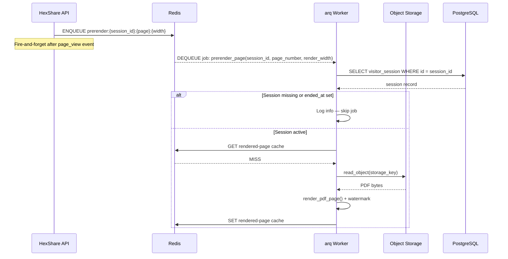
```mermaid
sequenceDiagram
    participant API as HexShare API
    participant Redis
    participant Worker as arq Worker
    participant Store as Object Storage
    participant PG as PostgreSQL

    API->>Redis: ENQUEUE prerender:{session_id}:{page}:{width}
    Note over API: Fire-and-forget after page_view event

    Redis-->>Worker: DEQUEUE job: prerender_page(session_id, page_number, render_width)

    Worker->>PG: SELECT visitor_session WHERE id = session_id
    PG-->>Worker: session record

    alt Session missing or ended_at set
        Worker->>Worker: Log info — skip job
    else Session active
        Worker->>Redis: GET rendered-page cache
        Redis-->>Worker: MISS
        Worker->>Store: read_object(storage_key)
        Store-->>Worker: PDF bytes
        Worker->>Worker: render_pdf_page() + watermark
        Worker->>Redis: SET rendered-page cache
    end
```

---

## 7. Authorization Flow

### Hybrid Access Control — Full Decision Path

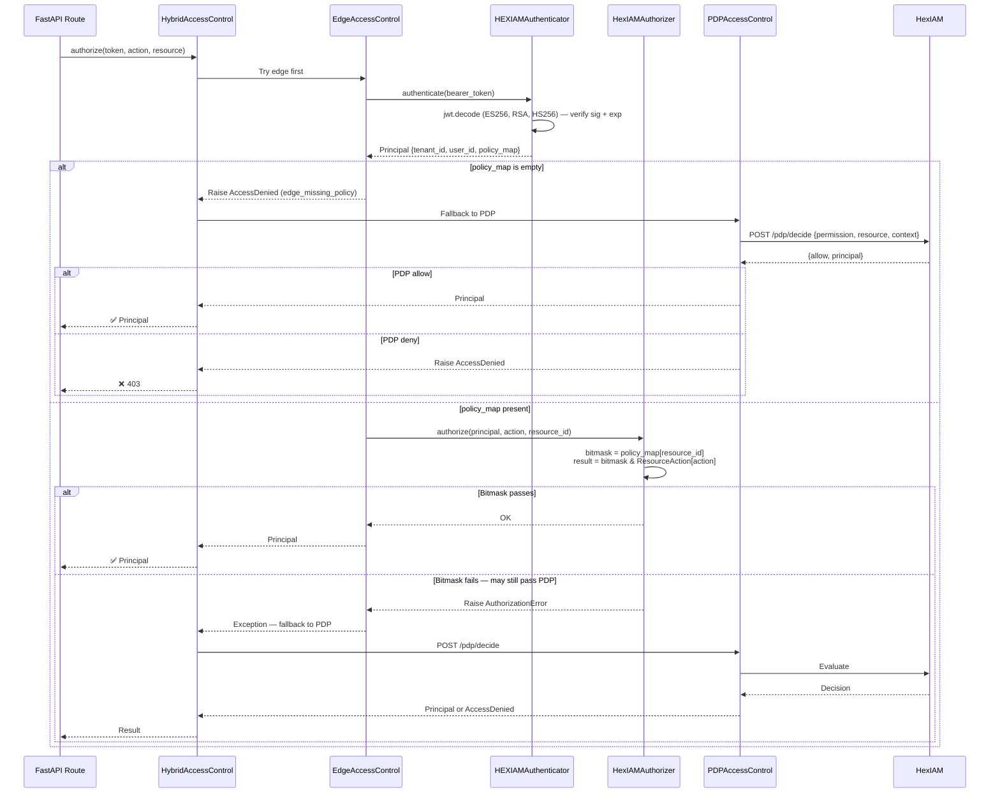
```mermaid
sequenceDiagram
    participant Route as FastAPI Route
    participant Hybrid as HybridAccessControl
    participant Edge as EdgeAccessControl
    participant Authn as HEXIAMAuthenticator
    participant Authz as HexIAMAuthorizer
    participant PDP as PDPAccessControl
    participant IAM as HexIAM

    Route->>Hybrid: authorize(token, action, resource)
    Hybrid->>Edge: Try edge first
    Edge->>Authn: authenticate(bearer_token)
    Authn->>Authn: jwt.decode (ES256, RSA, HS256) — verify sig + exp
    Authn-->>Edge: Principal {tenant_id, user_id, policy_map}

    alt policy_map is empty
        Edge-->>Hybrid: Raise AccessDenied (edge_missing_policy)
        Hybrid->>PDP: Fallback to PDP
        PDP->>IAM: POST /pdp/decide {permission, resource, context}
        IAM-->>PDP: {allow, principal}
        alt PDP allow
            PDP-->>Hybrid: Principal
            Hybrid-->>Route: ✅ Principal
        else PDP deny
            PDP-->>Hybrid: Raise AccessDenied
            Hybrid-->>Route: ❌ 403
        end
    else policy_map present
        Edge->>Authz: authorize(principal, action, resource_id)
        Authz->>Authz: bitmask = policy_map[resource_id]<br/>result = bitmask & ResourceAction[action]
        alt Bitmask passes
            Authz-->>Edge: OK
            Edge-->>Hybrid: Principal
            Hybrid-->>Route: ✅ Principal
        else Bitmask fails — may still pass PDP
            Authz-->>Edge: Raise AuthorizationError
            Edge-->>Hybrid: Exception — fallback to PDP
            Hybrid->>PDP: POST /pdp/decide
            PDP->>IAM: Evaluate
            IAM-->>PDP: Decision
            PDP-->>Hybrid: Principal or AccessDenied
            Hybrid-->>Route: Result
        end
    end
```

### Instance-level vs. Group-level Authorization Split

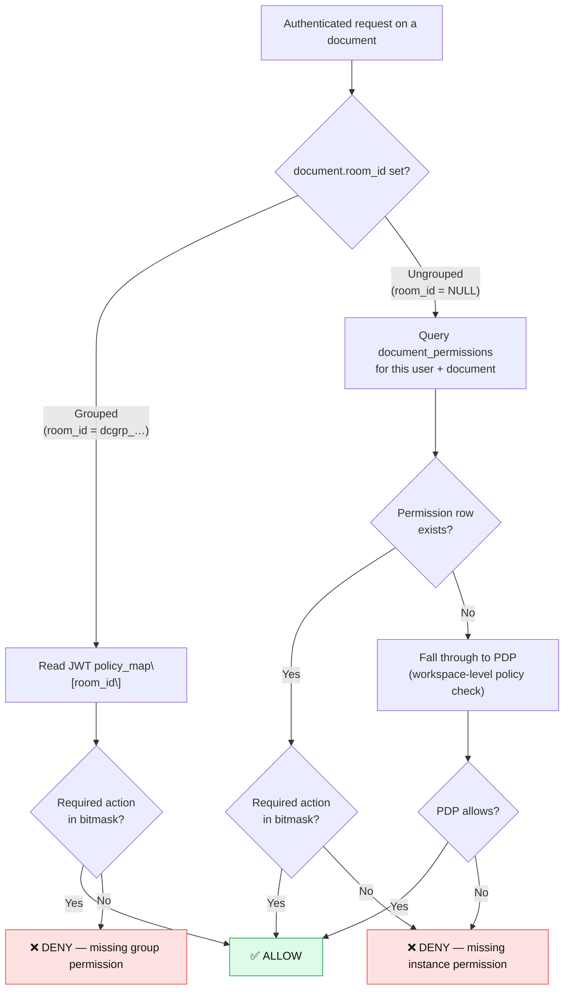
```mermaid
flowchart TD
    A["Authenticated request on a document"] --> B{"document.room_id set?"}

    B -->|"Grouped\n(room_id = dcgrp_…)"| C["Read JWT policy_map\[room_id\]"]
    C --> D{"Required action\nin bitmask?"}
    D -->|Yes| ALLOW["✅ ALLOW"]
    D -->|No| DENY1["❌ DENY — missing group permission"]

    B -->|"Ungrouped\n(room_id = NULL)"| E["Query document_permissions\nfor this user + document"]
    E --> F{"Permission row\nexists?"}
    F -->|Yes| G{"Required action\nin bitmask?"}
    G -->|Yes| ALLOW
    G -->|No| DENY2["❌ DENY — missing instance permission"]
    F -->|No| H["Fall through to PDP\n(workspace-level policy check)"]
    H --> I{"PDP allows?"}
    I -->|Yes| ALLOW
    I -->|No| DENY2

    style ALLOW fill:#dcfce7,stroke:#16a34a,color:#111
    style DENY1 fill:#fee2e2,stroke:#ef4444,color:#111
    style DENY2 fill:#fee2e2,stroke:#ef4444,color:#111
```

---

## 8. Adapter Selection at Startup

`app/main.py` reads environment variables during the FastAPI lifespan and selects concrete adapter implementations via named factory registries. No code changes are needed to swap infrastructure.

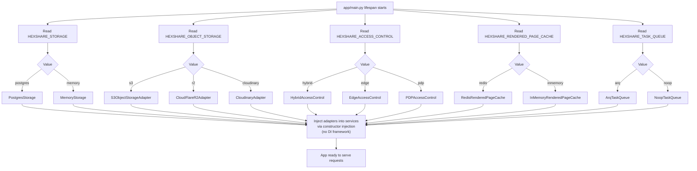
```mermaid
flowchart TD
    START["app/main.py lifespan starts"] --> S1 & S2 & S3 & S4 & S5

    S1["Read HEXSHARE_STORAGE"] --> C1{"Value"}
    C1 -->|postgres| D1["PostgresStorage"]
    C1 -->|memory| E1["MemoryStorage"]

    S2["Read HEXSHARE_OBJECT_STORAGE"] --> C2{"Value"}
    C2 -->|s3| D2["S3ObjectStorageAdapter"]
    C2 -->|r2| E2["CloudFlareR2Adapter"]
    C2 -->|cloudinary| F2["CloudinaryAdapter"]

    S3["Read HEXSHARE_ACCESS_CONTROL"] --> C3{"Value"}
    C3 -->|hybrid| D3["HybridAccessControl"]
    C3 -->|edge| E3["EdgeAccessControl"]
    C3 -->|pdp| F3["PDPAccessControl"]

    S4["Read HEXSHARE_RENDERED_PAGE_CACHE"] --> C4{"Value"}
    C4 -->|redis| D4["RedisRenderedPageCache"]
    C4 -->|inmemory| E4["InMemoryRenderedPageCache"]

    S5["Read HEXSHARE_TASK_QUEUE"] --> C5{"Value"}
    C5 -->|arq| D5["ArqTaskQueue"]
    C5 -->|noop| E5["NoopTaskQueue"]

    D1 & E1 & D2 & E2 & F2 & D3 & E3 & F3 & D4 & E4 & D5 & E5 --> WIRE["Inject adapters into services\nvia constructor injection\n(no DI framework)"]
    WIRE --> READY["App ready to serve requests"]
```

---

## 9. Data Flow Diagrams

### Document Upload Data Flow

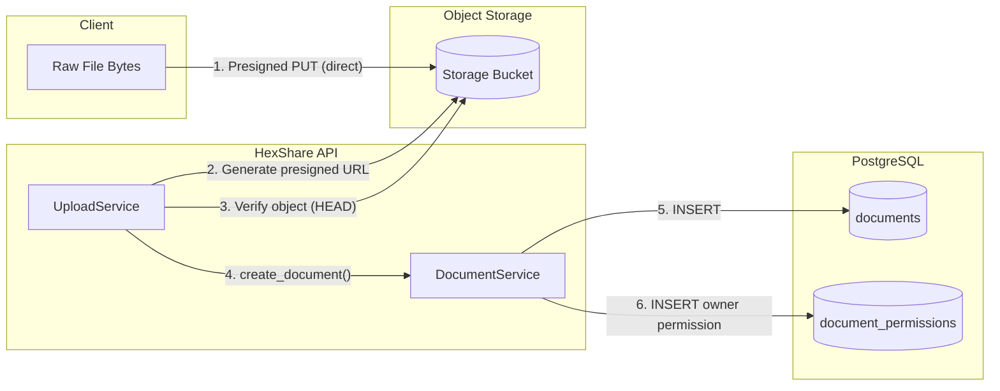
```mermaid
flowchart LR
    subgraph Client["Client"]
        FILE["Raw File Bytes"]
    end

    subgraph HexShareAPI["HexShare API"]
        UPLOAD_SVC["UploadService"]
        DOC_SVC["DocumentService"]
    end

    subgraph ObjectStorage["Object Storage"]
        BUCKET[("Storage Bucket")]
    end

    subgraph Postgres["PostgreSQL"]
        DOC_TABLE[("documents")]
        PERM_TABLE[("document_permissions")]
    end

    FILE -->|"1. Presigned PUT (direct)"| BUCKET
    UPLOAD_SVC -->|"2. Generate presigned URL"| BUCKET
    UPLOAD_SVC -->|"3. Verify object (HEAD)"| BUCKET
    UPLOAD_SVC -->|"4. create_document()"| DOC_SVC
    DOC_SVC -->|"5. INSERT"| DOC_TABLE
    DOC_SVC -->|"6. INSERT owner permission"| PERM_TABLE
```

### Page Render Data Flow

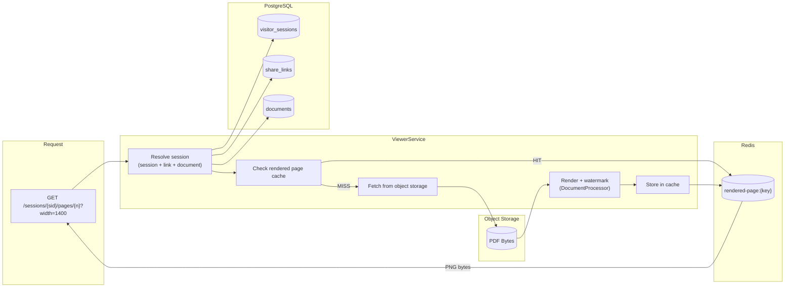
```mermaid
flowchart LR
    subgraph Request["Request"]
        REQ["GET /sessions/{sid}/pages/{n}?width=1400"]
    end

    subgraph ViewerService["ViewerService"]
        RESOLVE["Resolve session\n(session + link + document)"]
        CHECK["Check rendered page cache"]
        FETCH["Fetch from object storage"]
        RENDER["Render + watermark\n(DocumentProcessor)"]
        STORE_CACHE["Store in cache"]
    end

    subgraph Cache["Redis"]
        CACHE[("rendered-page:{key}")]
    end

    subgraph Storage["Object Storage"]
        OBJ[("PDF Bytes")]
    end

    subgraph DB["PostgreSQL"]
        SESS[("visitor_sessions")]
        LINKS[("share_links")]
        DOCS[("documents")]
    end

    REQ --> RESOLVE
    RESOLVE --> SESS & LINKS & DOCS
    RESOLVE --> CHECK
    CHECK -->|"HIT"| CACHE
    CHECK -->|"MISS"| FETCH
    FETCH --> OBJ
    OBJ --> RENDER
    RENDER --> STORE_CACHE --> CACHE
    CACHE -->|"PNG bytes"| REQ
```

---

## 10. Document Processing Pipeline

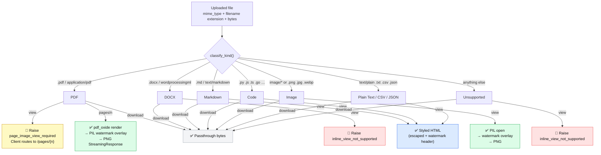
```mermaid
flowchart TD
    IN["Uploaded file\nmime_type + filename extension + bytes"]
    CL{"classify_kind()"}

    IN --> CL

    CL -->|".pdf / application/pdf"| PDF["PDF"]
    CL -->|".docx / wordprocessingml"| DOCX["DOCX"]
    CL -->|".md / text/markdown"| MD["Markdown"]
    CL -->|".py .js .ts .go …"| CODE["Code"]
    CL -->|"image/* or .png .jpg .webp"| IMG["Image"]
    CL -->|"text/plain .txt .csv .json"| TXT["Plain Text / CSV / JSON"]
    CL -->|"anything else"| UNSUP["Unsupported"]

    PDF -->|view| PDF_VIEW["🔀 Raise page_image_view_required\nClient routes to /pages/{n}"]
    PDF -->|pages/n| PDF_PAGE["✅ pdf_oxide render\n→ PIL watermark overlay\n→ PNG StreamingResponse"]
    PDF -->|download| DL_PASS["✅ Passthrough bytes"]

    DOCX -->|view| DOCX_VIEW["🚫 Raise inline_view_not_supported"]
    DOCX -->|download| DL_PASS

    MD -->|view| HTML["✅ Styled HTML\n(escaped + watermark header)"]
    MD -->|download| DL_PASS

    CODE -->|view| HTML
    CODE -->|download| DL_PASS

    IMG -->|view| IMG_VIEW["✅ PIL open\n→ watermark overlay\n→ PNG"]
    IMG -->|download| DL_PASS

    TXT -->|view| HTML
    TXT -->|download| DL_PASS

    UNSUP -->|view| UNSUP_VIEW["🚫 Raise inline_view_not_supported"]
    UNSUP -->|download| DL_PASS

    style PDF_VIEW fill:#fef9c3,stroke:#ca8a04,color:#111
    style DOCX_VIEW fill:#fee2e2,stroke:#ef4444,color:#111
    style UNSUP_VIEW fill:#fee2e2,stroke:#ef4444,color:#111
    style PDF_PAGE fill:#dcfce7,stroke:#16a34a,color:#111
    style IMG_VIEW fill:#dcfce7,stroke:#16a34a,color:#111
    style HTML fill:#dbeafe,stroke:#2563eb,color:#111
    style DL_PASS fill:#f3f4f6,stroke:#9ca3af,color:#111
```

| Format | Inline view | Page images | Download |
|---|---|---|---|
| PDF | Via `/pages/{n}` only | ✅ pdf_oxide + PIL | ✅ |
| DOCX | ❌ | ❌ | ✅ |
| Markdown | ✅ HTML | ❌ | ✅ |
| Code | ✅ HTML | ❌ | ✅ |
| Text / CSV / JSON / XML | ✅ HTML | ❌ | ✅ |
| Image | ✅ watermarked PNG | ❌ | ✅ |
| Other | ❌ | ❌ | ✅ |

---

## 11. Domain Model (ERD)

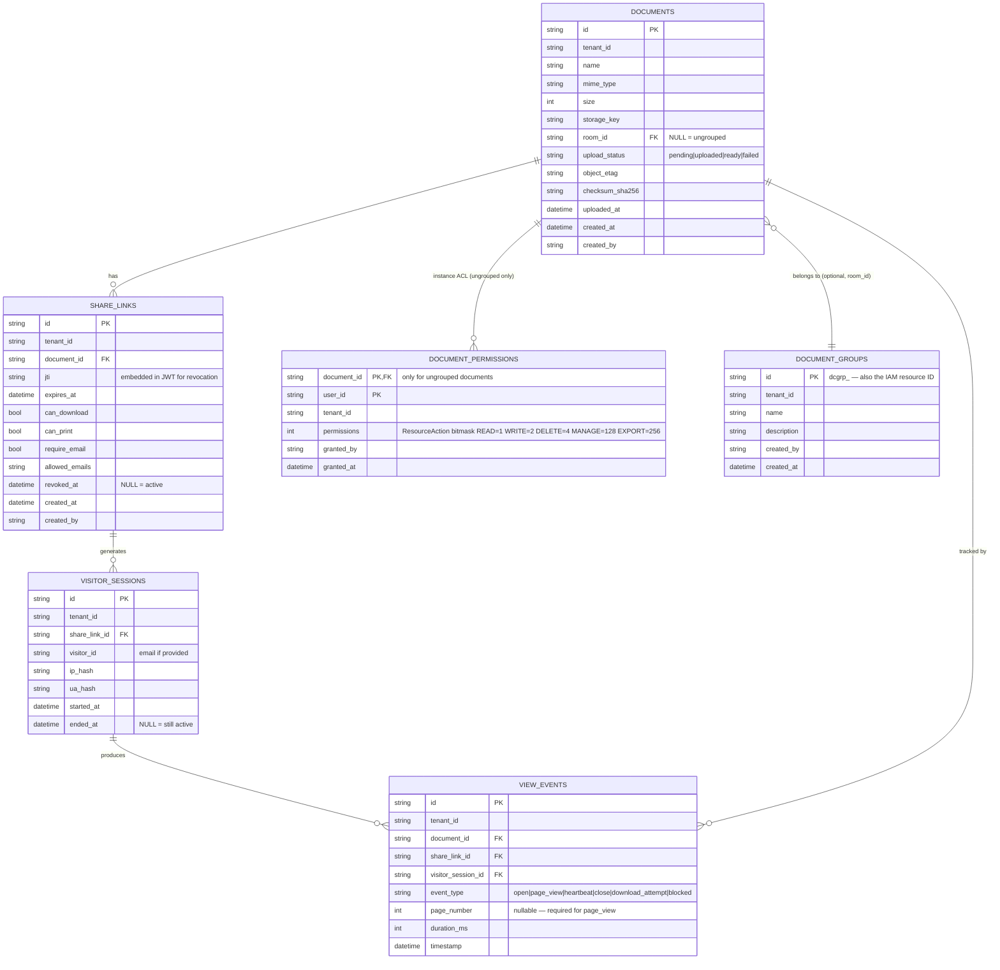
```mermaid
erDiagram
    DOCUMENTS ||--o{ SHARE_LINKS : "has"
    DOCUMENTS ||--o{ DOCUMENT_PERMISSIONS : "instance ACL (ungrouped only)"
    DOCUMENTS }o--|| DOCUMENT_GROUPS : "belongs to (optional, room_id)"
    SHARE_LINKS ||--o{ VISITOR_SESSIONS : "generates"
    VISITOR_SESSIONS ||--o{ VIEW_EVENTS : "produces"
    DOCUMENTS ||--o{ VIEW_EVENTS : "tracked by"

    DOCUMENTS {
        string id PK
        string tenant_id
        string name
        string mime_type
        int size
        string storage_key
        string room_id FK "NULL = ungrouped"
        string upload_status "pending|uploaded|ready|failed"
        string object_etag
        string checksum_sha256
        datetime uploaded_at
        datetime created_at
        string created_by
    }

    DOCUMENT_GROUPS {
        string id PK "dcgrp_<uuid> — also the IAM resource ID"
        string tenant_id
        string name
        string description
        string created_by
        datetime created_at
    }

    DOCUMENT_PERMISSIONS {
        string document_id PK,FK "only for ungrouped documents"
        string user_id PK
        string tenant_id
        int permissions "ResourceAction bitmask READ=1 WRITE=2 DELETE=4 MANAGE=128 EXPORT=256"
        string granted_by
        datetime granted_at
    }

    SHARE_LINKS {
        string id PK
        string tenant_id
        string document_id FK
        string jti "embedded in JWT for revocation"
        datetime expires_at
        bool can_download
        bool can_print
        bool require_email
        string allowed_emails
        datetime revoked_at "NULL = active"
        datetime created_at
        string created_by
    }

    VISITOR_SESSIONS {
        string id PK
        string tenant_id
        string share_link_id FK
        string visitor_id "email if provided"
        string ip_hash
        string ua_hash
        datetime started_at
        datetime ended_at "NULL = still active"
    }

    VIEW_EVENTS {
        string id PK
        string tenant_id
        string document_id FK
        string share_link_id FK
        string visitor_session_id FK
        string event_type "open|page_view|heartbeat|close|download_attempt|blocked"
        int page_number "nullable — required for page_view"
        int duration_ms
        datetime timestamp
    }
```

> **Authorization split:** `room_id IS NULL` → gated by `document_permissions` bitmask lookup. `room_id` set → gated by the JWT `policy_map[room_id]` bitmask — no extra DB lookup for grouped documents.

---

## 12. State Diagrams

### Share Link Lifecycle

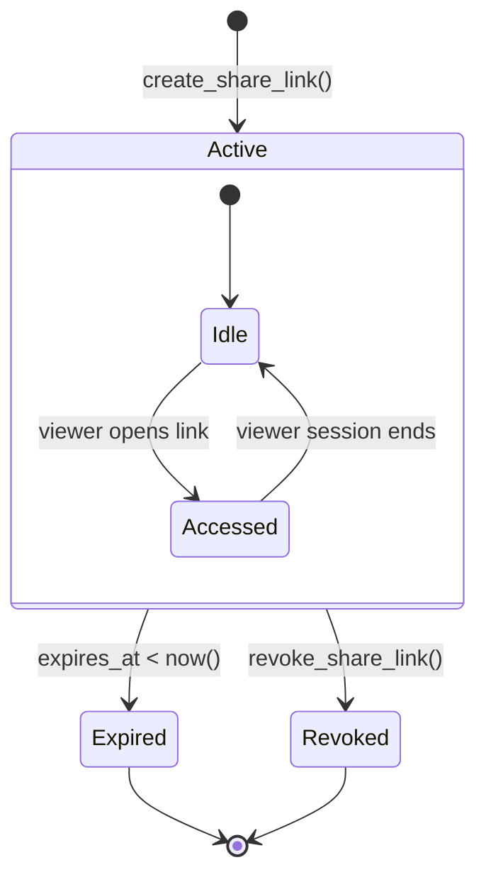
```mermaid
stateDiagram-v2
    [*] --> Active : create_share_link()
    Active --> Expired : expires_at < now()
    Active --> Revoked : revoke_share_link()
    Expired --> [*]
    Revoked --> [*]

    state Active {
        [*] --> Idle
        Idle --> Accessed : viewer opens link
        Accessed --> Idle : viewer session ends
    }
```

### Visitor Session Lifecycle

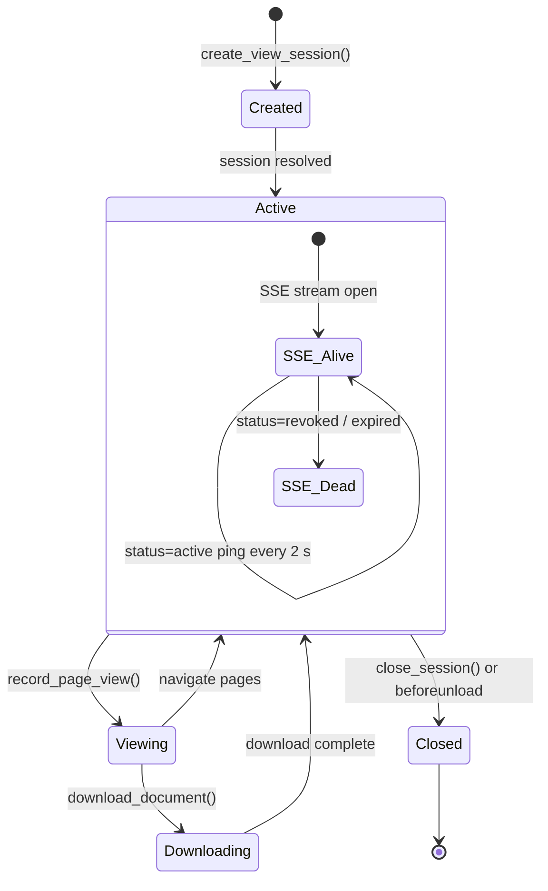
```mermaid
stateDiagram-v2
    [*] --> Created : create_view_session()
    Created --> Active : session resolved
    Active --> Viewing : record_page_view()
    Viewing --> Active : navigate pages
    Viewing --> Downloading : download_document()
    Downloading --> Active : download complete
    Active --> Closed : close_session() or beforeunload
    Closed --> [*]

    state Active {
        [*] --> SSE_Alive : SSE stream open
        SSE_Alive --> SSE_Alive : status=active ping every 2 s
        SSE_Alive --> SSE_Dead : status=revoked / expired
    }
```

---

## 13. Repository Architecture

```text
HexShare/
|-- app/                          # Backend application
|   |-- main.py                   # FastAPI app factory + lifespan wiring (composition root)
|   |
|   |-- domain/                   # Domain models - pure Pydantic, no logic, no ORM
|   |   `-- models.py             # Document, ShareLink, VisitorSession,
|   |                             #   ViewEvent, DocumentGroup, DocumentPermission
|   |
|   |-- ports/                    # Abstract interfaces - the hexagonal "contracts"
|   |   |-- storage_port.py       # StoragePort - CRUD for all entities
|   |   |-- token_port.py         # TokenPort - JWT encode/decode/revoke
|   |   |-- event_bus_port.py     # EventBusPort - publish domain events
|   |   |-- object_storage_port.py# ObjectStoragePort - read/write/presign
|   |   |-- rendered_page_cache_port.py
|   |   |-- task_queue_port.py    # TaskQueuePort - async job enqueue
|   |   |-- access_control.py     # AccessControlPort - combined authn/authz
|   |   |-- authn.py              # AuthenticatorPort - token -> Principal
|   |   |-- authz.py              # AuthorizerPort - bitmask evaluation
|   |   |-- iam_policy.py         # IAMPolicyPort - grant/revoke/list
|   |   `-- oidc_client.py        # OIDCClientPort - PKCE token exchange
|   |
|   |-- services/                 # Business logic - import ports only, never adapters
|   |   |-- document_service.py   # Document lifecycle + instance ACL enforcement
|   |   |-- document_group_service.py  # Group CRUD + IAM dual-write coordination
|   |   |-- link_service.py       # Share link create/revoke + JWT generation
|   |   |-- viewer_service.py     # View session management + page rendering
|   |   |-- upload_service.py     # Presigned upload orchestration
|   |   |-- analytics_service.py  # View event aggregation
|   |   |-- oidc_service.py       # PKCE flow state management
|   |   |-- local_session_service.py # Local access/refresh token issuance from OIDC user info
|   |   `-- document_processor.py # Format classify, PDF render, watermark, HTML wrap
|   |
|   |-- adapters/                 # Concrete implementations - import infra, implement ports
|   |   |-- persistence/
|   |   |   |-- postgres_storage.py   # asyncpg + raw SQL - no ORM
|   |   |   `-- memory_storage.py     # In-memory (tests, dev)
|   |   |-- object_storage/
|   |   |   |-- s3.py                 # S3 / MinIO via boto3
|   |   |   |-- r2.py                 # Cloudflare R2 (extends S3)
|   |   |   `-- cloudinary_adapter.py
|   |   |-- cache/
|   |   |   |-- in_memory_rendered_page_cache.py  # LRU OrderedDict, maxsize=200
|   |   |   `-- redis_rendered_page_cache.py      # pickle serialization
|   |   |-- queue/
|   |   |   |-- noop_task_queue.py
|   |   |   `-- arq_task_queue.py     # Dedup by job_id = prerender:{sid}:{page}:{width}
|   |   |-- access_control/
|   |   |   |-- edge.py               # JWT claims only - no network
|   |   |   |-- pdp.py                # Full PDP delegation -> HexIAM
|   |   |   `-- hybrid.py             # Edge first, PDP fallback (default)
|   |   |-- auth/                     # HEXIAMAuthenticator + LocalJWTAuthenticator
|   |   |-- authz/                    # HexIAMAuthorizer - bitmask evaluator
|   |   |-- iam/                      # HexIAMPolicyClient + LocalIAMPolicyClient
|   |   |-- oidc/                     # HexIAMOIDCClient + GoogleOIDCClient
|   |   |-- jwt_token.py              # JWTTokenAdapter - share token lifecycle + JTI revocation backends
|   |   `-- noop_event_bus.py         # EventBusPort stub - drop-in replacement point
|   |
|   |-- api/                      # HTTP layer - thin, delegates to services
|   |   |-- router.py             # Documents, groups, links, viewer sessions, pages
|   |   |-- auth_oidc.py          # /api/auth/* - login/callback/refresh/logout
|   |   |-- uploads.py            # /api/v1/uploads/* - presigned initiate + complete
|   |   `-- dependencies/services.py  # FastAPI DI helpers (request.app.state.*)
|   |
|   |-- auth/                     # FastAPI dependencies that sit between HTTP and services
|   |   |-- tenant_auth.py        # TenantPrincipal extraction (Bearer + cookie fallback)
|   |   `-- share_token_auth.py   # Share JWT -> ShareTokenClaims
|   |
|   |-- core/
|   |   |-- authz.py              # ResourceAction IntFlag bitmask enum + helpers
|   |   `-- flow_state.py         # Signed JWT OIDC flow state (PKCE tmp cookie)
|   |
|   |-- schemas/                  # Pydantic request/response schemas (API contract)
|   |   |-- pagination.py
|   |   |-- share.py
|   |   |-- upload.py
|   |   `-- viewer.py
|   |
|   |-- infra/
|   |   |-- bootstrap.py          # Side-effect import - triggers factory self-registration
|   |   `-- factories.py          # StorageFactory, ObjectStorageFactory, ... (registry pattern)
|   |
|   `-- workers/
|       `-- prerender_worker.py   # arq WorkerSettings - same service layer as API
|
|-- frontend/                     # React + TypeScript SPA
|   `-- src/
|       |-- pages/                # Dashboard, DocumentDetails, Groups, Login, Signup, Landing
|       |-- components/           # Layout, Badge, Button, Card, Modal, HexLogo
|       |-- hooks/                # useInfiniteScroll and related UI hooks
|       |-- services/api.ts       # Typed API client + auto-refresh interceptor on 401
|       |-- types.ts              # TypeScript domain types (mirrors Python domain models)
|       `-- lib/utils.ts          # cn(), formatBytes()
|
|-- migrations/                   # yoyo reversible migrations
|   |-- 0001_create_hexshare_core_tables.py
|   |-- 0002_add_hexshare_indexes.py
|   |-- 0003_add_document_upload_metadata.py
|   |-- 0004_add_document_groups_and_permissions.py
|   `-- 0005_add_local_auth_and_group_memberships.py
|
|-- tests/
|   |-- unit/                     # Pure unit tests - all ports stubbed, no infra
|   |-- api/                      # Route tests via FastAPI TestClient
|   |-- schemas/
|   `-- services/
|
|-- Dockerfile                    # Multi-stage (Poetry builder -> slim Python runtime)
|-- docker-compose.yaml           # Default deployable stack
|-- docker-compose.dev.yaml       # Development stack (hot-reload volume mounts)
|-- docker-compose.with-hexiam.yaml # Overlay to run HexShare and HexIAM together
|-- entrypoint.sh                 # Uvicorn factory mode, configurable workers
|-- SELF_HOST.md                  # Operator guide for self-hosting and HexIAM bundling
|-- hexiam.env.bundle.example     # Template env for the bundled HexIAM checkout
|-- run_migrations.py             # Standalone yoyo runner
|-- scripts/prepare_hexiam.py     # Clone/update HexIAM into .hexiam/
`-- pyproject.toml                # Poetry dependencies
```


### Key Design Decisions

- **`app/main.py` is the sole composition root.** All adapters are instantiated and injected into services during the FastAPI lifespan. No DI framework — explicit constructor injection only.
- **Factory pattern for adapter selection.** Each port has a `*Factory` class with a `_registry` dict. Adapters self-register via decorators. `HEXSHARE_*` env vars drive selection at startup.
- **Services depend only on ports.** `DocumentService.__init__` takes `StoragePort` and `EventBusPort`, never `PostgresStorage`. This is the core hexagonal discipline — enforced by convention (no linter rule yet).
- **Domain models are pure Pydantic.** No business logic, no ORM, no framework coupling. Serializable to dicts for storage or transport.
- **Worker shares the same service layer.** `prerender_worker.py` builds the same `ViewerService` with the same ports, ensuring identical behavior between API and background jobs.

---

## 14. Hexagonal Architecture Explained

### The Pattern

```mermaid
flowchart LR
    inbound["Driving Adapters\nHTTP routes · Auth dependencies · arq worker"]
    core["Application Core\nDomain models + Services"]
    ports["Ports\nAbstract interfaces owned by the core"]
    outbound["Driven Adapters\nPostgres · MinIO · Redis · JWT · HexIAM"]

    inbound --> core
    core --> ports
    ports --> outbound
```

- **Domain + Services:** The core. Knows nothing about HTTP, databases, or file systems.
- **Ports:** Interfaces that the core defines and depends on. `StoragePort` = "I need to store documents."
- **Adapters:** Concrete implementations of ports. `PostgresStorage` = "Here's how to store them in Postgres."

### How HexShare Implements It

**1. Ports are abstract base classes.**

```python
# app/ports/storage_port.py
class StoragePort(ABC):
    @abstractmethod
    async def save_document(self, document: Document) -> None: ...
    @abstractmethod
    async def get_document(self, *, tenant_id: str, document_id: str) -> Optional[Document]: ...
```

**2. Services depend on ports, never on adapters.**

```python
# app/services/document_service.py
class DocumentService:
    def __init__(self, storage: StoragePort, event_bus: EventBusPort) -> None:
        self._storage = storage      # ← interface, not implementation
        self._event_bus = event_bus  # ← interface, not implementation
```

**3. Adapters implement ports.**

```python
# app/adapters/persistence/postgres_storage.py
class PostgresStorage(StoragePort):
    async def save_document(self, document: Document) -> None:
        async with self._pool.acquire() as conn:
            await conn.execute("INSERT INTO documents (...) VALUES (...)", ...)
```

**4. Factories select adapters at startup based on environment.**

```python
# app/main.py (lifespan)
persistence_layer = StorageFactory.create(
    os.getenv("HEXSHARE_STORAGE", "postgres"),
    pool=dp_pool,
)
```

### Advantages in HexShare

| Advantage | Concrete Impact |
|---|---|
| **Swappable infrastructure** | `HEXSHARE_OBJECT_STORAGE=r2` swaps MinIO → Cloudflare R2 at deploy time. Zero service-layer changes. |
| **Testability** | Unit tests inject `MemoryStorage` + `NoopEventBus`. No database, no Redis, no network. Millisecond runs. |
| **Deferred decisions** | Started with in-memory storage; migrated to Postgres when schema stabilized. Service layer never changed. |
| **Parallel development** | One developer builds the S3 adapter, another builds Cloudinary. Both implement `ObjectStoragePort` and register via the factory. |
| **IdP independence** | `HEXSHARE_AUTHENTICATOR=hexiam` today. Adding Okta or Keycloak means implementing `AuthenticatorPort` + `OIDCClientPort` and registering them. No service changes. |
| **Graceful degradation** | `HEXSHARE_TASK_QUEUE=noop` disables background prerendering without removing the feature. `HEXSHARE_RENDERED_PAGE_CACHE=inmemory` works without Redis. Every component has a lightweight fallback. |
| **Managed hosting isolation** | Each tenant can be provisioned with a dedicated MinIO prefix, bucket, or even instance. The service layer never sees bucket names. |

### Dependency Rule

Dependencies point **inward only:**

```
HTTP Routes  ──►  Services  ──►  Ports  ◄──  Adapters
                                  ▲
                            (services import ports,
                             never adapters)
```

The API layer calls services. Services call port methods. Adapters implement port methods. `app/main.py` is the only place that couples ports to adapters.

---

## 15. Runtime & Infrastructure

### Docker Compose Service Map

```mermaid
flowchart TD
    USERS["👤 👥 Users"] --> FE["hexshare-frontend\nNginx + React SPA"]
    FE -->|"/api/* proxy"| API["hexshare\nFastAPI · uvicorn 2 workers"]
    API --> PG[("PostgreSQL 17")]
    API --> REDIS[("Redis 7")]
    API --> STORE[("MinIO / Object Storage")]
    API --> IDP["Identity Provider\nHexIAM"]
    API -.->|"enqueues jobs"| WORKER["hexshare-worker\narq · 4 concurrent jobs"]
    WORKER --> PG
    WORKER --> REDIS
    WORKER --> STORE
    MIGRATE["hexshare-migrate\nyoyo apply (one-shot)"] --> PG
```

### Startup Sequence

```mermaid
sequenceDiagram
    participant Docker
    participant PG as PostgreSQL
    participant Store as MinIO
    participant StoreInit as minio-create-bucket
    participant Redis
    participant Migrate as hexshare-migrate
    participant API as hexshare
    participant Worker as hexshare-worker
    participant Frontend as hexshare-frontend

    Docker->>PG: Start container
    Docker->>Store: Start container
    Docker->>Redis: Start container

    PG->>PG: pg_isready healthcheck
    StoreInit->>Store: Wait, then mc mb --ignore-existing {bucket}

    Docker->>Migrate: Start (depends_on: pg healthy)
    Migrate->>PG: yoyo apply all pending migrations
    Migrate-->>Docker: Exit 0

    Docker->>API: Start (depends_on: migrate done, store init done, redis healthy)
    API->>API: lifespan: create pools, wire adapters, inject services

    Docker->>Worker: Start (depends_on: migrate done, store init done, redis healthy)
    Worker->>Worker: on_startup: create pools, wire same service layer

    Docker->>Frontend: Start (depends_on: API healthcheck passes)
    Frontend->>Frontend: nginx serves static assets + proxies /api/*
```

### Bundled HexIAM Overlay

The base `docker-compose.yaml` stack runs HexShare with its own PostgreSQL, Redis, MinIO, worker, and frontend. The optional `docker-compose.with-hexiam.yaml` overlay adds:

- a HexIAM API container
- a HexIAM admin portal container
- dedicated PostgreSQL and Redis services for HexIAM
- host-to-container wiring so browser redirects use `HEXIAM_PUBLIC_URL` while PDP calls stay on the internal Docker network

The overlay is meant to be paired with `scripts/prepare_hexiam.py`, which clones or refreshes the companion HexIAM repository into `.hexiam/hexalgon-iam-system` and drops a starter `.env.bundle` file there for operators to edit.

### Runtime Switches

| Variable | Options | Purpose |
|---|---|---|
| `HEXSHARE_STORAGE` | `postgres`, `memory` | Metadata persistence adapter |
| `HEXSHARE_AUTHENTICATOR` | `hexiam`, `local` | Access-token verification mode |
| `HEXSHARE_DEFAULT_OIDC_IDP` | `hexiam`, `google` | Default browser login provider |
| `HEXSHARE_OBJECT_STORAGE` | `s3`, `r2`, `cloudinary` | Object-storage adapter |
| `HEXSHARE_ACCESS_CONTROL` | `hybrid`, `edge`, `pdp` | Authorization strategy |
| `HEXSHARE_IAM_POLICY` | `hexiam`, `local` | IAM policy coordination adapter |
| `HEXSHARE_RENDERED_PAGE_CACHE` | `inmemory`, `redis` | Rendered-page cache backend |
| `HEXSHARE_SHARE_TOKEN_REVOCATION_STORE` | `memory`, `redis` | Share-link JTI revocation backend |
| `HEXSHARE_TASK_QUEUE` | `noop`, `arq` | Background queue backend |
| `HEXSHARE_VIEWER_STRATEGY` | `secure_streaming` | Document delivery mode |
| `HEXSHARE_DOCUMENT_PROCESSING_ENABLED` | `true`, `false` | Enable/disable document processor |
| `HEXSHARE_API_WORKERS` | integer | uvicorn worker count |
| `HEXSHARE_API_REPLICAS` | integer | Docker Compose API replicas |
| `HEXSHARE_WORKER_REPLICAS` | integer | Docker Compose worker replicas |
| `HEXSHARE_ARQ_MAX_JOBS` | integer | Concurrent arq jobs per worker |

---